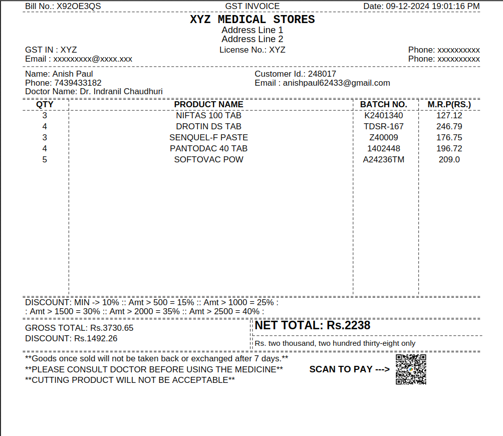

# Medical Shop Invoice Generator

#### Video Demo: <https://youtu.be/l5y6fEVfy84>

## Overview

The **Medical Shop Invoice Maker** is a Python-based tool designed to manage inventory and customer billing for a medical store. It simplifies tasks like adding product details, searching by batch number, generating invoices with the unique bill number,

## Features

- **Customer Management**: Add customer details like name, phone number, email and doctor’s name. It generate a unique customer id for every new customer. Before taking any order, it verify the formats of the name, phone number, and email. Like a name can't contain any number or special characters. A phone number and email has it's own format. This program checks that with `regex`. If, the given details are not in correct format it will again reprompt for the customer details. The best thing is it store every customer's details in a csv file and you can analyse that data for marketing and any other purpose.

- **Product Management**: Add product details such as product name, batch number, quantity, and M.R.P.

- **Inventory Update**: You can search any product with the help of batch number.Everytime a product sold will automatically update the inventory with new quantity of the product.

- **Invoice Generation**: By running this program you will get a bill of tabular form in your command line interface. Every important details will be there. The main feature of this program is that it will generate a Pdf file of the bill and the name of the file will be `BillNumber.pdf`.

- **Discount Structure**: The program has a predefined discount structure. That automatically applies on the total bill amount and with that details it will generate the pdf bill.

## Technologies Used

- Python
- `csv` for data storage
- `re` for input validation
- `fpdf` for PDF invoice generation
- `tabulate` for console display
- `pytz` for timezone handling
- `inflect` for converting numbers to words
- `random` for generating random int
- `string` for joining strings
- `datetime` for printing realtime date & time

### Generated Pdf: 